````markdown
# 🧾 LAPORAN PRAKTIKUM 5 – JAVASCRIPT

Nama: M.Ridho Febrian
NIM: 312410500
Kelas: TI.24.A.5  
Mata Kuliah: Pemrograman Web  
Dosen Pengampu: Agung Nugroho, S.Kom., M.Kom  
Universitas: Pelita Bangsa  
Praktikum ke: 5  
---

# Lab5Web: Praktikum 5 - JavaScript Dasar

Proyek ini adalah hasil pengerjaan Modul Praktikum Pemrograman Web: **Praktikum 5 - Javascript** dari Universitas Pelita Bangsa. Repositori ini berisi file-file HTML yang mengimplementasikan konsep dasar JavaScript, mulai dari sintaks dasar hingga manipulasi elemen HTML (DOM) dan validasi form.

---

## 🎯 Tujuan Praktikum

Tujuan dari praktikum ini adalah agar mahasiswa mampu:

1.  Memahami **sintak dasar Javascript**.
2.  Memahami **penggunaan javascript**.
3.  Membuat **kode javascript sederhana**.
4.  **Memanipulasi elemen HTML** dengan Javascript.

---

## 📂 Struktur Proyek

Struktur proyek ini disusun untuk memuat semua kode latihan yang disajikan dalam modul praktikum. Semua file adalah dokumen HTML tunggal, kecuali untuk latihan eksternal JS (jika dikerjakan).

Lab5Web/

├── lab5_javascript.html (Latihan dasar: document.write, console.log)

├── alert_box.html (Contoh penggunaan window.alert)

├── document_write_method.html (Contoh pemakaian document.write)

├── prompt_example.html (Contoh pemakaian prompt)

├── function_onload.html (Contoh fungsi dipanggil melalui event body onload)

├── arithmetic_operations.html (Contoh operasi aritmatika) 

├── if_else_selection.html (Contoh seleksi kondisi if..else)

├── switch_selection.html (Contoh seleksi kondisi switch)

├── form_input_tebak_bil.html (Contoh manipulasi form, tebak ganjil/genap)

├── form_button_color.html (Contoh manipulasi document color dengan button)

├── HTML DOM: Perhitungan Otomatis CheckBox (daftar_menu.html)

├──form_validation.html (Jawaban Tugas: Script validasi form)


└── README.md

---
````
## 💻 Langkah-langkah Praktikum dan Contoh Kode (12 File)

Berikut adalah ringkasan, contoh kode, serta **hasil dan penjelasan** dari setiap langkah praktikum:

### 1. Dasar: `document.write` dan `console.log` (`lab5_javascript.html`)

Contoh dasar penulisan kode JavaScript di dalam tag `<body>` .

```html
<!DOCTYPE html>
<html lang="en">
<body>
    <h1>Pengenalan JavaScript</h1>
    <h3>Contoh document.write dan console.log</h3>
    <script>
        document.write("Hello World"); 
        console.log("Hello World");    
    </script>
</body>
</html>
```
**TAMPILAN dan VSCODE**

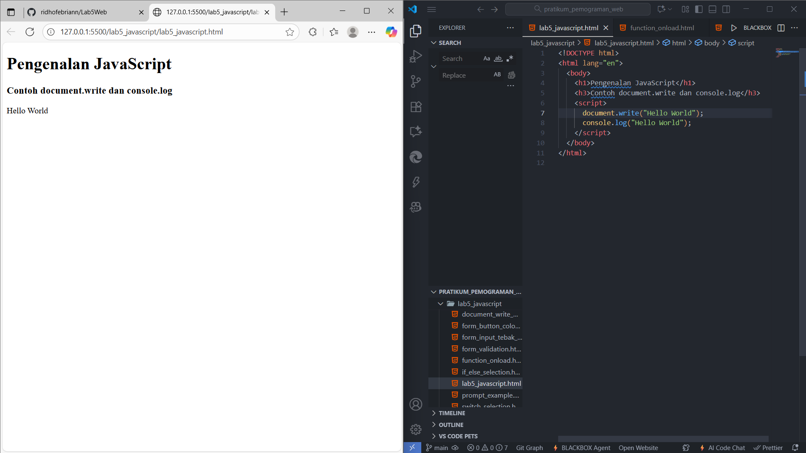

Hasil : Teks "Hello World" muncul di halaman web dan di Console browser .

Penjelasan Hasil:  `document.write()` menulis konten ke dokumen HTML. `console.log()` menulis pesan ke konsol browser untuk debugging.

### 2. Penggunaan `window.alert` (`alert_box.html`)
Membuat kotak peringatan (alert box) saat halaman dimuat
```html
<html>
<body>
    <script language="javascript">
        window.alert("ini merupakan pesan untuk anda"); // Pesan peringatan 
    </script>
</body>
</html>
```
```javascript
window.alert("ini merupakan pesan untuk anda");
```
**TAMPILAN dan VSCODE**

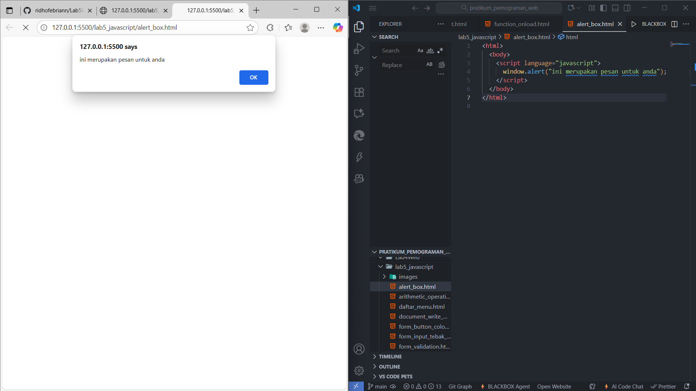

Hasil: Sebuah kotak dialog peringatan (alert box) muncul dengan pesan "ini merupakan pesan untuk anda".

Penjelasan Hasil: `window.alert()` menampilkan data dalam kotak peringatan, yang harus ditutup oleh pengguna

###  3. Pemakaian `document.write Method (`document_write_method.html`)
Contoh penggunaan `document.write` untuk menampilkan beberapa baris teks.
```html
<html>
<body>
    percobaan memakai javascript:<br>
    <script language="javascript">
        document.write("selamat mencoba javascript<br>"); 
        document.write("semoga sukses!"); 
    </script>
</body> 
</html>
```
```javascript
document.write("selamat mencoba javascript<br>");
document.write("semoga sukses!");
```
**TAMPILAN dan VSCODE**

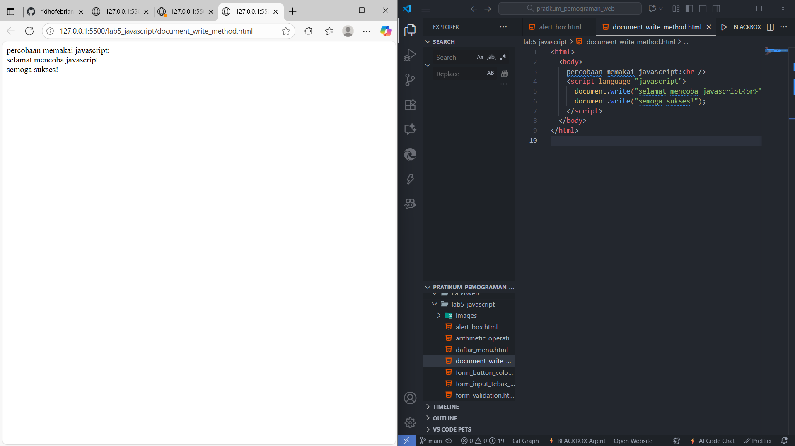

Hasil: 
Halaman akan menampilkan:
```
percobaan memakai javascript:
selamat mencoba javascript
semoga sukses!
```
Penjelasan Hasil: `document.write()` digunakan dua kali untuk memasukkan teks ke dalam HTML secara berurutan

### 4. Pemakaian `prompt` (`prompt_example.html`)
Menggunakan fungsi `prompt` untuk mendapatkan input dari pengguna.
```html
<html>
<body>
    <script language="javascript">
        var nama = prompt("siapa nama anda?", "masukkan nama anda"); 
        document.write("hai, " + nama); 
    </script>
</body>
</html>
```
```javascript
var nama = prompt("siapa nama anda?", "masukkan nama anda");
document.write("hai, " + nama);
```
**TAMPILAN dan VSCODE**

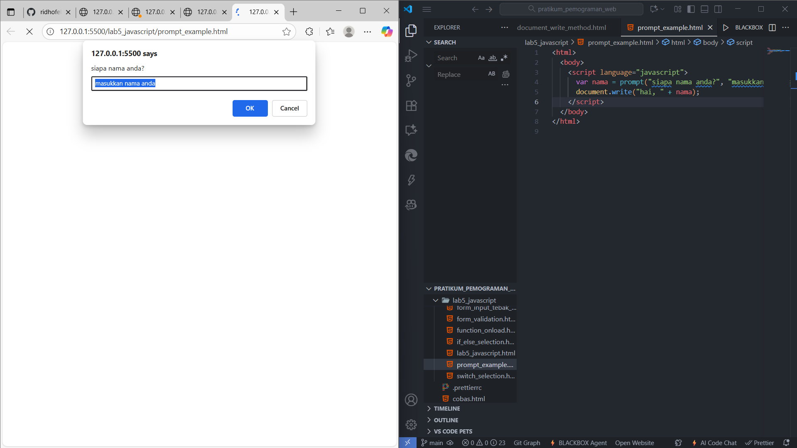

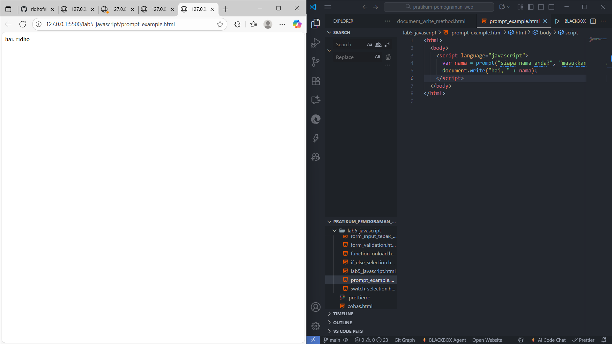

Hasil :  Muncul prompt box. Jika nama diisi "ridho", halaman menampilkan "hai, ridho".

Penjelasan Hasil: Fungsi `prompt()` meminta input teks dari pengguna dan menyimpannya dalam variabel `nama`.

### 5. Pembuatan Fungsi dan Pemanggilan dengan `onload` (`function_onload.html`)
Membuat fungsi JavaScript dan memanggilnya saat `<body>` selesai dimuat.
```html
<html>
<head>
    <title>contoh program javascript</title>
    <script language="javascript">
        function pesan(){
            alert ("memanggil javascript lewat body onload") 
        }
    </script>
</head>
<body onload="pesan()"> </body>
</html>
```
```javascript
function pesan(){ alert ("memanggil javascript lewat body onload") }
// ...
<body onload="pesan()">
```
**TAMPILAN dan VSCODE**

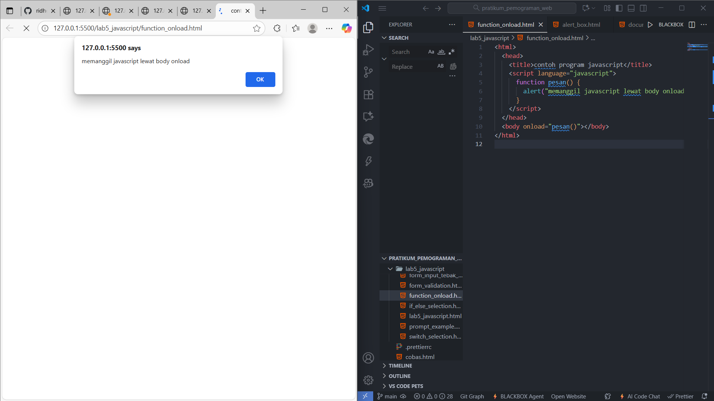

Hasil:  Setelah halaman dimuat, alert box otomatis muncul dengan pesan "memanggil javascript lewat body onload".

Penjelasan Hasil: Atribut `onload` pada `<body>` adalah event handler yang mengeksekusi fungsi `pesan()` setelah semua elemen halaman selesai dimuat.

### 6. Operasi Dasar Aritmatika (`arithmetic_operations.html`)
Contoh implementasi operasi aritmatika dasar secara langsung.
```html
<!DOCTYPE html>
<html lang="en">
<head>
    <title>Operasi Aritmatika</title>
</head>
<body>
    <script>
        var a = 10;
        var b = 5;
        
        var c = a + b; 
        document.write("Hasil Penjumlahan: " + c + "<br>");
        
        c = a - b; 
        document.write("Hasil Pengurangan: " + c + "<br>");
        
        c = a * b;
        document.write("Hasil Perkalian: " + c + "<br>");
        
        c = a / b;
        document.write("Hasil Pembagian: " + c + "<br>");
    </script>
</body>
</html>
```
```javascript
var a = 10; var b = 5;
document.write("Penjumlahan: " + (a + b) + "<br>"); // Hasil 15
// ... operasi lainnya
```
**TAMPILAN dan VSCODE**

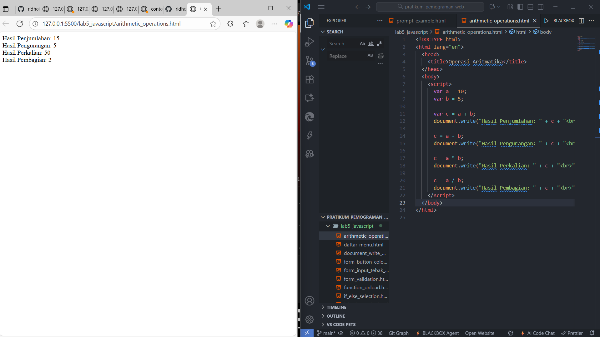

Hasil:  Halaman akan menampilkan:
```
Hasil Penjumlahan: 15
Hasil Pengurangan: 5
Hasil Perkalian: 50
Hasil Pembagian: 2
```
Penjelasan Hasil: Variabel `a` (10) dan `b` (5) digunakan untuk melakukan operasi Penjumlahan (`+`), Pengurangan (`-`), Perkalian (`*`), dan Pembagian (`/`), dengan hasilnya dicetak menggunakan `document.write()`.

### 7. Seleksi Kondisi `if..else` (`if_else_selection.html`)
Contoh seleksi kondisi untuk menentukan kelulusan berdasarkan nilai input.
```html
<html>
<body>
    <script language="javascript">
        var nilai = prompt("nilai (0-100): ", 0); 
        var hasil = "";
        if (nilai >= 60) { 
            hasil = "lulus"; 
        } else { 
            hasil = "tidak lulus"; 
        }
        document.write("hasil: " + hasil);
    </script>
</body>
</html>
```
```javascript
if (nilai >= 60) { hasil = "lulus"; } else { hasil = "tidak lulus"; }
document.write("hasil: " + hasil);
```
**TAMPILAN dan VSCODE**

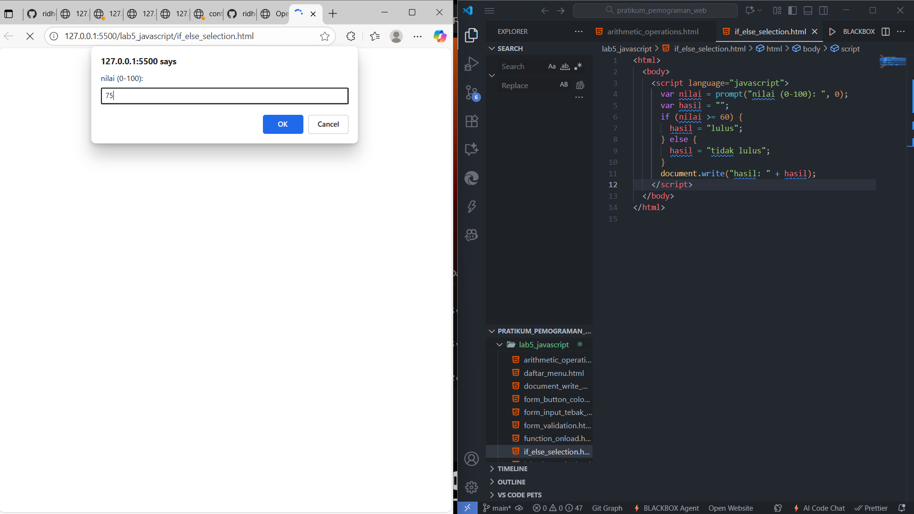

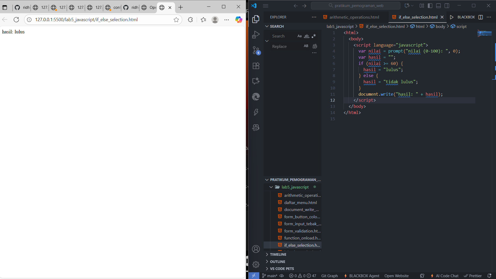

Hasil: Jika Input 75, hasil "lulus". Jika Input 55, hasil "tidak lulus".

Penjelasan Hasil: Pernyataan `if (nilai >= 60)` mengecek kondisi. Jika benar, variabel `hasil` diisi "lulus"; jika salah (blok `else`), diisi "tidak lulus".

### 8. Seleksi Kondisi `switch` (`switch_selection.html`)
Contoh penggunaan operator `switch` untuk seleksi kondisi pada beberapa nilai.
```html
<script language="javascript">
    function test () {
        val1 = window.prompt("input nilai (1-5):")
        switch (val1) {
            case "1":
                document.write("bilangan satu"); break
            // ... cases 2, 3, 4, 5 ...
            default:
                document.write("bilangan lainnya");
        }
    }
</script>
<body>
    <input type="button" name="button" value="switch" onclick="test()">
</body>
```
```javascript
switch (val1) {
    case "1": document.write("bilangan satu"); break;
    default: document.write("bilangan lainnya");
}
```
**TAMPILAN dan VSCODE**

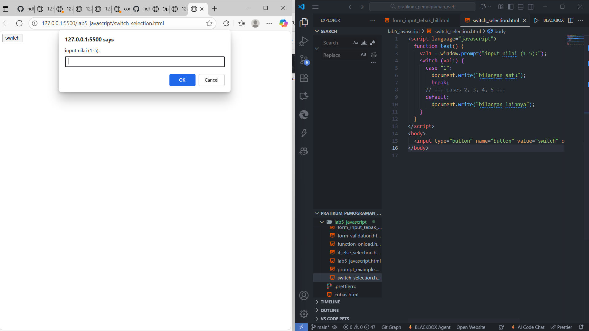

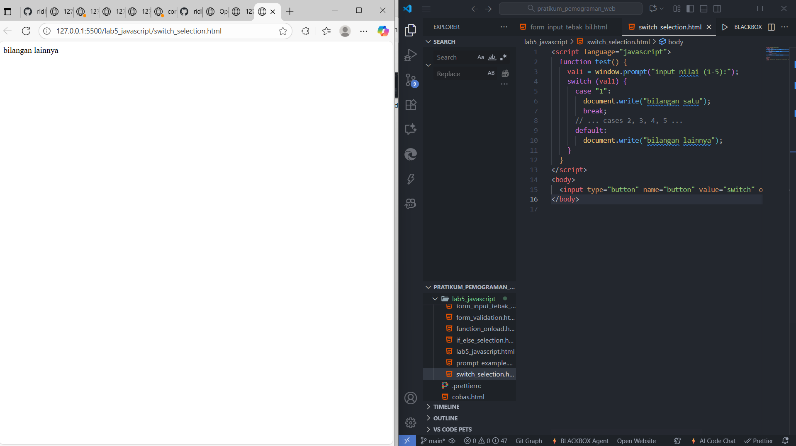

Hasil:  Setelah klik tombol, muncul prompt. Jika Input 3, halaman menampilkan "bilangan tiga".

Penjelasan Hasil: Struktur `switch` membandingkan nilai variabel `val1` dengan serangkaian `case`. Jika cocok, kode di bawah case tersebut dieksekusi, dan `break`menghentikan eksekusi.

### 9. Form Input: Cek Ganjil/Genap (form_input_tebak_bil.html)
Manipulasi form: mengambil input, memproses, dan menampilkan hasil di form yang sama.
```html
<script language="javascript">
  function test() {
    var val1 = document.kirim.T1.value;

    var num = parseInt(val1);

    if (isNaN(num)) {
      document.kirim.T2.value = "Input harus berupa angka!";
      return;
    }

    if (num % 2 == 0) {
      document.kirim.T2.value = "bilangan genap";
    } else {
      document.kirim.T2.value = "bilangan ganjil";
    }
  }
</script>
<body>
   
  <form method="POST" name="kirim">
       
    <p>
      BIL <input type="text" name="T1" size="20" />     MERUPAKAN BIL
      <input type="text" name="T2" size="20" />
    </p>
       
    <p><input type="button" value="TEBAK" name="B1" onclick="test()" /></p>
     
  </form>
</body>
```
**TAMPILAN dan VSCODE**

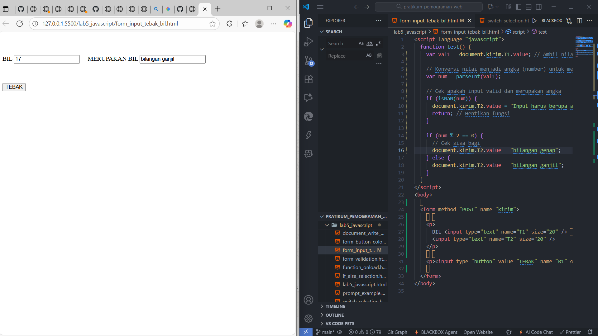

Penjelasan:

Fungsi test() bertugas mengonversi teks input (T1) menjadi angka (parseInt).

Validasi: Kode pertama-tama mengecek apakah hasil konversi adalah angka yang valid (isNaN). Jika tidak valid, fungsi akan menampilkan error dan berhenti (return).

Logika: Jika valid, ia menggunakan operator modulus (% 2) untuk menentukan sisa bagi.

Output: Jika sisa bagi 0, field T2 diisi "bilangan genap"; jika tidak, diisi "bilangan ganjil".

### 10. Form Button: Ubah Warna Dokumen (`form_button_color.html`)
Mengubah warna latar belakang dan teks dokumen menggunakan properti objek `document`.
```html
<script language="javascript">
  function ubahwarnaLB(warna) {
    document.bgColor = warna;
  }
  function ubahwarnaLD(warna) {
    // <--- DEFINISI FUNGSI
    document.fgColor = warna; // <--- PASTIKAN BARIS INI ADA
  }
</script>
<body>
  <h1>tes</h1>

  <form>
    <input
      type="button"
      value="Latar Belakang Hijau"
      onclick="ubahwarnaLB('GREEN')"
    />

    <input type="button" value="Teks Biru" onclick="ubahwarnaLD('BLUE')" />  
  </form>
</body>
```
**TAMPILAN dan VSCODE**

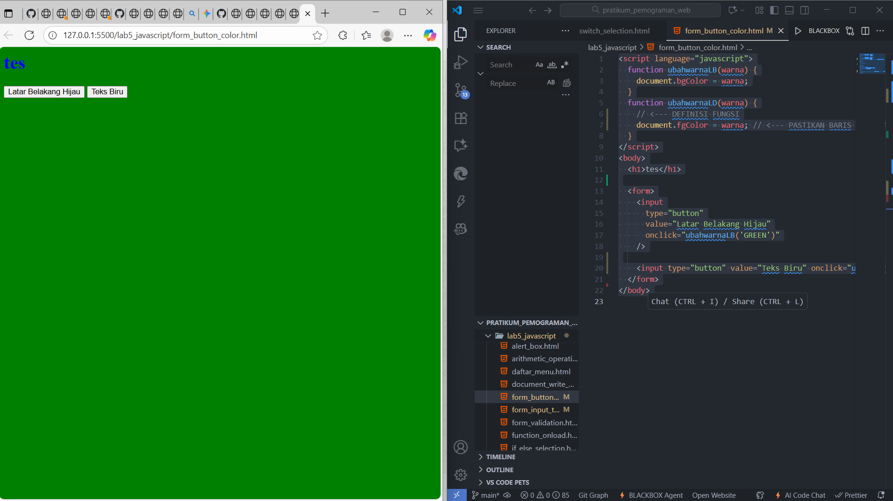

penjelasan:

Kode ini mendefinisikan dua fungsi untuk memanipulasi properti tampilan dokumen:

ubahwarnaLB(warna): Mengatur warna latar belakang halaman melalui properti document.bgColor.

ubahwarnaLD(warna): Mengatur warna teks di halaman melalui properti document.fgColor.

Fungsi-fungsi ini dipanggil oleh tombol yang sesuai di HTML melalui event onclick dengan meneruskan nama warna (misalnya, 'GREEN' atau 'BLUE').

### 11. Jawaban Tugas: Validasi Form (`form_validation.html`)
Implementasi skrip validasi sederhana untuk memastikan field tidak kosong dan format email dasar valid.
```html
<form name="formValid" onsubmit="return validasi()">
Nama: <input type="text" name="nama"><br>
Email: <input type="text" name="email"><br>
<input type="submit" value="Kirim">
</form>

<script>
function validasi() {
    let nama = document.forms["formValid"]["nama"].value;
    let email = document.forms["formValid"]["email"].value;
    if (nama == "" || email == "") {
        alert("Nama dan Email wajib diisi!");
        return false;
    }
    alert("Data berhasil dikirim!");
    return true;
}
</script>
```
**TAMPILAN dan VSCODE**

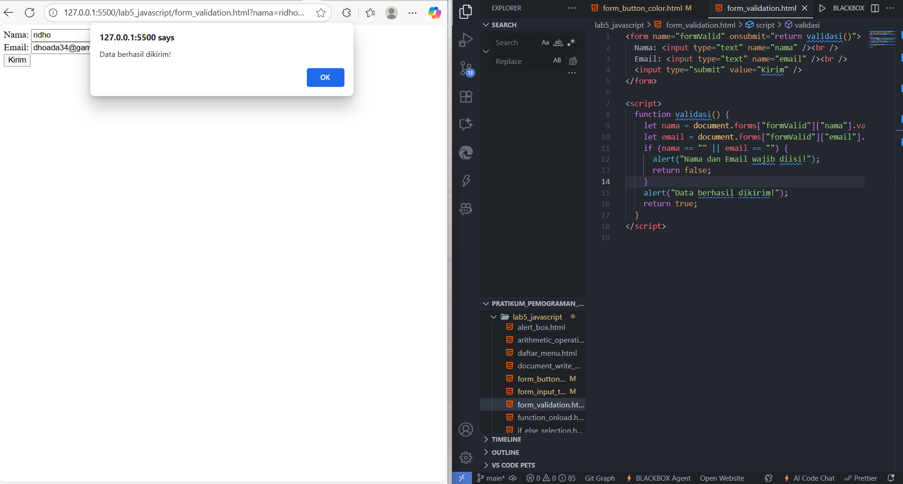

Hasil: Jika Nama kosong, proses submit dibatalkan dan muncul alert "Nama harus diisi.".

Penjelasan Hasil: Fungsi validasi() bekerja saat tombol Kirim pada formulir diklik (karena ada onsubmit="return validasi()").

Pengambilan Data: Kode mengambil nilai yang diisi pada field Nama dan Email .

Pengecekan: Kode memeriksa apakah nama ATAU (||) email kosong ("").

Kasus Gagal: Jika salah satu atau kedua field kosong, kode menampilkan alert "Nama dan Email wajib diisi!" dan mengembalikan return false.

Hasil: Nilai false ini akan menghentikan proses pengiriman formulir.

Kasus Berhasil: Jika kedua field terisi, kode menampilkan alert "Data berhasil dikirim!" dan mengembalikan return true.

Hasil: Nilai true ini akan melanjutkan proses pengiriman formulir ke server

### 12. HTML DOM: Perhitungan Otomatis CheckBox (daftar_menu.html)
HTML DOM (Document Object Model) untuk melakukan perhitungan otomatis dari total harga menu yang dipilih menggunakan checkbox.
```html
<html>
<head>
    <title>Daftar Menu</title>
    <script>
        function hitung(ele) {
            
            var total = document.getElementById('total').value;
            total = (total ? parseInt(total) : 0); 

            var harga = parseInt(ele.value);

            if (ele.checked) {
                
                total = total + harga;
            } else {
               
                total = total - harga;
            }
            document.getElementById('total').value = total;
        }
    </script>
</head>
<body>
    <h1>Daftar Menu Makanan</h1>
    
    <label><input type="checkbox" value="3000" onclick="hitung(this)" /> Ayam Goreng Rp. 5.000</label><br />
    
    <label><input type="checkbox" value="500" onclick="hitung(this)" /> Tempe Goreng Rp. 500</label><br />
    
    <label><input type="checkbox" value="2500" onclick="hitung(this)" /> Telur Dadar Rp. 2.500</label><hr />
    
    <strong>Total Bayar Rp. <input id="total" type="text" readonly /></strong>
</body>
</html>
```
```javascript
function hitung(ele) {
    var total = (total ? parseInt(total) : 0); 
    var harga = parseInt(ele.value);
    if (ele.checked) { total = total + harga; } else { total = total - harga; }
    document.getElementById('total').value = total;
}
```
**TAMPILAN dan VSCODE**

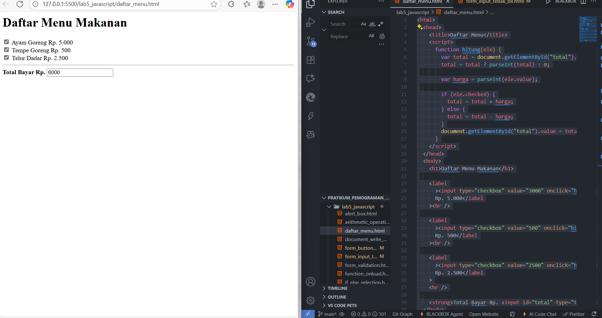

Hasil:
Awalnya, kotak input Total Bayar kosong (atau 0).

Pengguna mencentang Ayam Goreng (value 3000): Total menjadi 3000.

Pengguna mencentang Tempe Goreng (value 500): Total menjadi 3500.

Pengguna melepaskan centang pada Ayam Goreng: Total kembali menjadi 500.

Penjelasan Hasil:
Fungsi hitung(ele) dipicu oleh event onclick pada setiap checkbox, dan this dilewatkan sebagai argumen (ele), merujuk pada elemen checkbox itu sendiri.

Pengambilan Nilai: Fungsi mengambil total harga saat ini dari input teks dengan document.getElementById('total').value.

Logika:

Jika ele.checked (dicentang), nilai numerik dari checkbox (ele.value) ditambahkan ke total.

Jika tidak dicentang (dilepas), nilai numerik dikurangi dari total.

Output: Nilai total yang baru kemudian diperbarui ke dalam field input total. Ini adalah contoh klasik DOM manipulation di mana JavaScript membaca dan menulis nilai ke elemen-elemen HTML.
